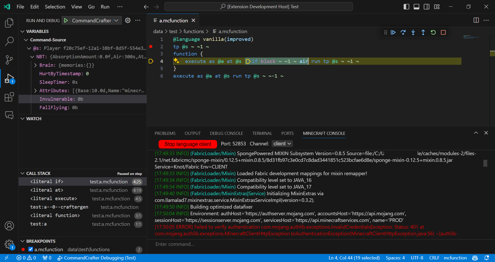

# CommandCrafter

The CommandCrafter Minecraft mod aims to provide useful tools for command development.

With this mod and the corresponding the CommandCrafter vscode extension, it is possible to connect vscode to the running Minecraft instance and get datapack language support for whatever Minecraft you're running. Besides syntax highlighting, error checking, definition providers and hover providers, this includes debugging functionality that allows you to set breakpoints and step through functions while keeping track of the current command context. Additionally, vscode can show you the log output of the server you're on and lets you directly execute commands from the vscode window.

Additionally, the mod includes a flexible extension of the vanilla datapack parser, which can itself be extended by addons to support new languages. This mod provides an improved version of the vanilla function language, currently offering multiline commands without backslashes and inline functions/tags. This new function syntax can be transpiled to a vanilla datapack by the mod using the `/datapack build` command.

The following is an example of the changes this extension can
make in vscode:

## Installation and Usage

For information on how to install and use the mod, visit the [Getting Started](wiki/Getting-Started) page on the wiki.

## License

This mod is licensed under the MIT License (see [LICENSE](LICENSE)).

This mod distributes with the [LSP4J library](https://github.com/eclipse-lsp4j/lsp4j), which is licensed under the Eclipse Distribution License 1.0 (see https://www.eclipse.org/org/documents/edl-v10.html), and distributes with parts of the [GSON library](https://github.com/google/gson), which is licensed under the Apache License 2.0 (see https://github.com/google/gson/blob/main/gson/LICENSE).  
