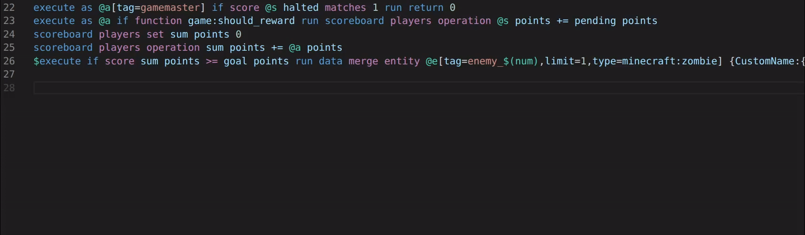

# CommandCrafter

This [Fabric mod](https://modrinth.com/mod/commandcrafter) and [VSCode extension](https://marketplace.visualstudio.com/items?itemName=Papierkorb2292.commandcrafter) connects your editor to Minecraft, giving you lots of useful features for datapacks, such as:
- Syntax Highlighting (including macros)
- Auto-completion
- Error checking
- A debugger that lets you set breakpoints and step through functions and evaluate arguments while paused
- Viewing and editing scoreboards/storages in your editor
- Viewing the client's and the server's log in your editor
- Reload datapacks, resourcepacks or shaders with VSCode commands (can be bound to keyboard shortcuts or configured to happen [automatically](https://github.com/Papierkorb2292/CommandCrafter/wiki/Config#automatic-reload) upon saving a file)

CommandCrafter differs from traditional datapack extensions in that everything it does is provided by the mod, which means it can use all the data available inside Minecraft. For example the auto-completion for commands can for the most part use the vanilla suggestions, which means you see all scoreboards that exist in a world or all functions known to Minecraft. CommandCrafter can detect any commands or dynamic registries added by other mods as well. This connection to Minecraft is also what makes the debugger and other features, which require deep integration with Minecraft, possible.

Additionally, the mod includes an extension of the vanilla function syntax, which optionally makes it possible to write multiline commands without backslashes and write inline functions/tags. This new function syntax can be transpiled to a vanilla datapack by the mod using the `/datapack build` command.

For more info, visit the [wiki](https://github.com/Papierkorb2292/CommandCrafter/wiki).

The following VSCode screenshot shows off the highlighting, the debugger, the Scoreboard/Storage Viewer, the Minecraft log and the function syntax:

## Installation and Usage

For information on how to install and use the mod, visit the [Getting Started](https://github.com/Papierkorb2292/CommandCrafter/wiki/Getting-Started) page on the wiki.

## License

This mod is licensed under the MIT License (see [LICENSE](LICENSE)).

This mod distributes with the [LSP4J library](https://github.com/eclipse-lsp4j/lsp4j), which is licensed under the Eclipse Distribution License 1.0 (see https://www.eclipse.org/org/documents/edl-v10.html), and distributes with parts of the [GSON library](https://github.com/google/gson), which is licensed under the Apache License 2.0 (see https://github.com/google/gson/blob/main/gson/LICENSE).  

# Special Thanks
I want to thank all the following awesome people for testing and giving feedback for this project:
- [Kesuaheli](https://www.github.com/Kesuaheli)
- [Percy](https://www.youtube.com/@percyarin.studios)
- [Mideks](https://www.github.com/Mideks)
- [Mantis Whale](https://github.com/JabraelNoael)
- Energy
- [Yondonator](https://www.github.com/yondonator)
- [Mqxx](https://www.github.com/Mqxx)