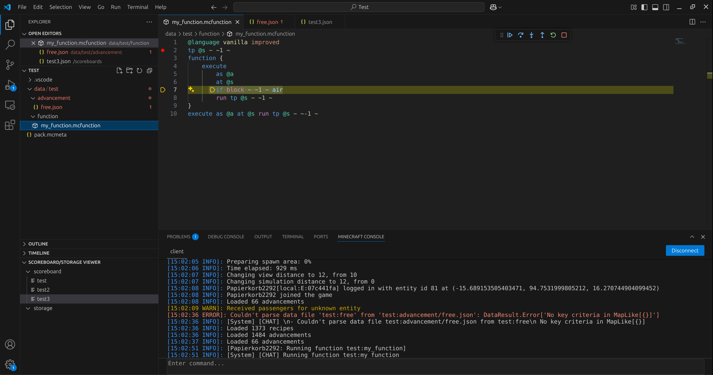

# CommandCrafter

The CommandCrafter Minecraft mod aims to provide
useful tools for command development. This mod
is still in development, with many features not yet
implemented.

These tools include a flexible extension of the vanilla
datapack parser, which can itself be extended to
support new languages. This mod provides an
improved version of the vanilla function language,
currently offering multiline commands without
backslashes and inline functions/tags.
This new function syntax can be transpiled to
a vanilla datapack by the mod using the `/datapack build`
command.

More importantly, with the CommandCrafter vscode extension,
it is possible to connect vscode to the running Minecraft
instance and get datapack language support for whatever
Minecraft you're running. Besides syntax highlighting, this
includes debugging functionality
that allows you to set breakpoints and step through functions
while keeping track of the current command context. Additionally,
vscode can show you the log output of the server you're on and
lets you directly execute commands from the vscode window.

The following is an example of the changes this extension can
make in vscode:

## License

This mod is licensed under the MIT License (see [LICENSE](LICENSE)).

This mod distributes with the [LSP4J library](https://github.com/eclipse-lsp4j/lsp4j), which is licensed under the Eclipse Distribution License 1.0 (see https://www.eclipse.org/org/documents/edl-v10.html)
